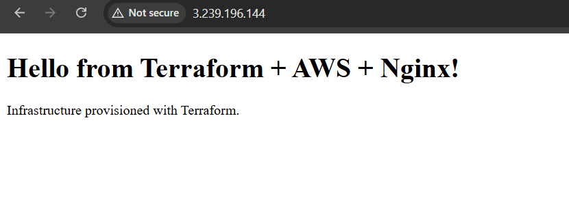

# Terraform Nginx End-to-End Demo

A standalone dummy DevOps project demonstrating Terraform provisioning of a
complete AWS network and an Nginx web server.

This project **does not depend on the AWS default VPC or default subnet**.
Terraform creates its own VPC and networking.

<p align="center">
  
</p>

## Architecture

```text
Internet
   |
Internet Gateway
   |
Public Route Table
   |
Public Subnet (10.0.1.0/24)
   |
EC2 - Amazon Linux 2023
   |
Nginx :80
```

## Resources created

- VPC (`10.0.0.0/16`)
- Public subnet (`10.0.1.0/24`)
- Internet Gateway
- Public route table and route
- Route-table association
- Security group allowing HTTP port 80
- Amazon Linux 2023 EC2 instance
- Nginx installed automatically with EC2 user data

The AMI is selected automatically from the AWS public SSM parameter for the
latest Amazon Linux 2023 x86_64 AMI. No hard-coded AMI ID is required.

## Prerequisites

- AWS account
- AWS CLI
- Terraform >= 1.5
- Permission to create VPC, subnet, route table, internet gateway, security
  group, and EC2 resources

Authenticate using your normal AWS CLI/profile method.

```bash
aws sts get-caller-identity
```

## Deploy

```bash
terraform init
terraform fmt
terraform validate
terraform plan
terraform apply
```

Type `yes` when prompted.

After deployment:

```bash
terraform output
```

Open the `website_url` output in your browser.

You can also test:

```bash
curl http://<PUBLIC_IP>
```

Expected page:

```text
Hello from Terraform + AWS + Nginx!
```

## Destroy

This is a demo project. Remove the resources after testing:

```bash
terraform destroy
```

Type `yes` when prompted.

## Project structure

```text
terraform-nginx-end-to-end/
├── README.md
├── main.tf
├── variables.tf
├── outputs.tf
├── terraform.tfvars.example
└── .gitignore
```

## Workflow

```text
Terraform code
      |
terraform init
      |
terraform fmt / validate
      |
terraform plan
      |
terraform apply
      |
AWS VPC + Networking + EC2
      |
Nginx
      |
Verify website
      |
terraform destroy
```

## Security

- No AWS credentials are stored in this repository.
- Terraform state files are ignored.
- No company credentials or confidential infrastructure are used.
- This is a learning/demo project, not production infrastructure.
